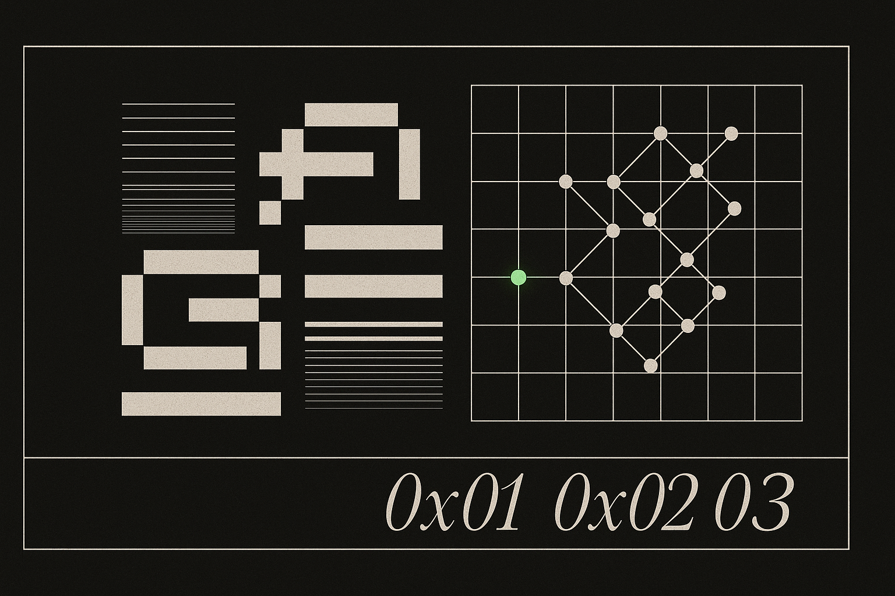

  

### Hi! I'm missingus3r! 👋

Software engineer from Uruguay building AI-driven tools, marketplaces, and developer infrastructure. Mostly solo work, mostly **Node.js / Python / C#**. Currently obsessed with self-evolving AI systems — what happens when you give an LLM cron jobs, a memory database, and time.

- 📫 [x.com/missingus3r](https://x.com/missingus3r)
- 🌐 [countdowntoai.com](https://www.countdowntoai.com)
- 🤖 [friday-showcase](https://missingus3r.github.io/friday-showcase/)
- 🧩 [bots-hub](https://missingus3r.github.io/bots-hub/)

#### Tech stack

  
  

#### Projects

<table>
<tr>
<td width="33%" align="center" valign="top">
 
<b>Bots Hub</b> 
Shared message bus that lets multiple chat-bot assistants (Claude / Codex / Gemma) coordinate in the same group, with turn-limit + cooldown guardrails.  
<a href="https://missingus3r.github.io/bots-hub/">Page</a> · <a href="https://github.com/missingus3r/bots-hub">Repo</a>
</td>
<td width="33%" align="center" valign="top">
 
<b>Road to AGI</b> 
Interactive timeline of 540+ AI models, AGI countdown, benchmarks and platforms.  
<a href="https://www.countdowntoai.com">Live</a>
</td>
<td width="33%" align="center" valign="top">
 
<b>Friday Showcase</b> 
24/7 AI assistant built entirely on Claude Code ($100/month), running 19 cron jobs for self-audit, model monitoring, reflections and daily briefings.  
<a href="https://missingus3r.github.io/friday-showcase/">Live</a>
</td>
</tr>
<tr>
<td width="33%" align="center" valign="top">
 
<b>Memory Graph</b> 
D3.js force-directed graph visualization of Friday's memory system. Embedded HTTP API in Python with SQLite WAL.  
<a href="https://github.com/missingus3r/memory-graph">Repo</a>
</td>
<td width="33%" align="center" valign="top">
 
<b>CC Usage Widget</b> 
Terminal dashboard + floating Electron widget showing your Claude Code usage. No API tokens — reuses your local session.  
<a href="https://github.com/missingus3r/CC_usage_widget">Repo</a>
</td>
<td width="33%" align="center" valign="top">
 
<b>Q1</b> 
AI-powered desktop overlay subsystem for Windows / Linux / macOS.  
<a href="https://missingus3r.github.io/q1/">Live</a>
</td>
</tr>
<tr>
<td width="33%" align="center" valign="top">
 
<b>Dokta</b> 
Landing project — health / care concept site.  
<a href="https://missingus3r.github.io/dokta/">Live</a>
</td>
<td width="33%" align="center" valign="top">
 
<b>Austra</b> 
Super app — weather, AI assistant, exchange rates and forum.  
<a href="https://github.com/missingus3r/austra">Repo</a>
</td>
<td width="33%" align="center" valign="top">
 
<b>Portfolio</b> 
Personal portfolio site — cyber-brutalist aesthetic, multi-language.  
<a href="https://missingus3r.github.io">Live</a>
</td>
</tr>
<tr>
<td width="33%" align="center" valign="top">
 
<b>LTI Hub</b> 
Info hub, chatbot and forum for Uruguay's tech university.  
<a href="https://github.com/missingus3r/lti.uy_v2">Repo</a>
</td>
<td width="33%" align="center" valign="top">
 
<b>PNG/BMP Compressor</b> 
Lossless compressor preprocessor for images.  
<a href="https://github.com/missingus3r/PNG-BMP-Lossless-Compressor-Preprocessor-">Repo</a>
</td>
<td width="33%" align="center" valign="top">
 
<b>Random File Compressor</b> 
Lossless random binary file compression.  
<a href="https://github.com/missingus3r/random_file_compressor">Repo</a>
</td>
</tr>
<tr>
<td width="33%" align="center" valign="top">
 
<b>GPTWrapper</b> 
GPT API chat GUI.  
<a href="https://github.com/missingus3r/GPTWrapper">Repo</a>
</td>
<td width="33%" align="center" valign="top">
 
<b>ZeroApi Twitter Bot</b> 
Twitter bot made in Python without using the official API.  
<a href="https://github.com/missingus3r/ZeroApi_Twitter_Bot">Repo</a>
</td>
<td width="33%"></td>
</tr>
</table>

---

